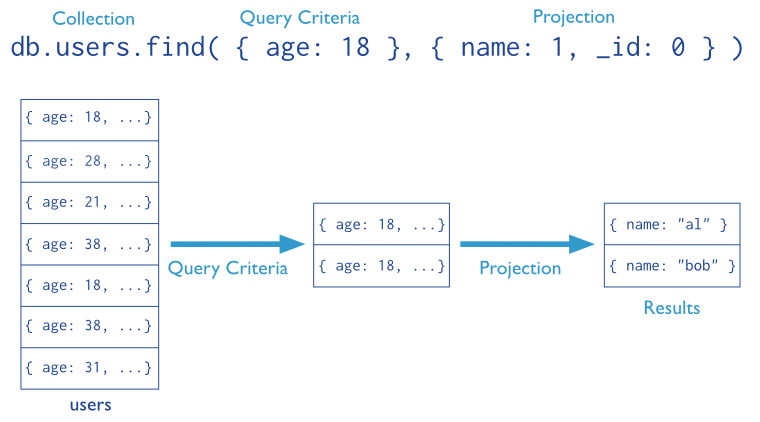

# MongoDB 学习笔记

## 数据迁移

- Useage:

mongodump --host mongodb1.example.net --port 37017 --username user --password pass --out /opt/backup/mongodump-2011-10-24

mongorestore --host mongodb1.example.net --port 37017 --username user --password pass /opt/backup/mongodump-2011-10-24

- Example:

mongodump --host 61.152.132.246 --port 27017 --db augmarketing --username aug --password abc123_ --out /home/user/Documents/backup/mongodump-2015-07-27

mongorestore --host 127.0.0.1 --port 27017 /home/user/Documents/backup/mongodump-2015-07-27

## Create User

*1. Enter the db to be authorized.*

```shell
use wm
```

*2. Create a user and grant read and write privilege to db `wm`*

```shell
db.createUser(
    {
        user:"root",
        pwd:"root",
        roles:[
            {
                role:"readWrite",
                db:"wm"
            }
        ]
    });
```
User has been created successfully if mongo console prompts this info:

```shell
Successfully added user: {
    "user" : "root",
    "roles" : [
        {
            "role" : "readWrite",
            "db" : "wm"
        }
    ]
}
```

*3. Now you can switch to corresponding db and verify if the user has the authorization.*

```shell
use wm;

db.auth("root", "root")
```

## Commonly Used Operations

- Query
    - In the following diagram, the query process specifies a query criteria and a sort modifier:

    

    - Sample format:
    ```shell
    db.collection.find({..query clause..}, {..projection..})
                 .skip(10)
                 .limit(10)
                 .sort({..sort conditions..});
    ```

    

- Pretty Outputting

    ```shell
    db.collection.find().pretty();
    ```

- Query Selectors
    Referring to official documents https://docs.mongodb.org/manual/reference/operator/query/#query-selectors

- [Update](https://docs.mongodb.org/manual/reference/method/db.collection.update/#db.collection.update)
    ```shell
    db.collection.update(
        <query>,
        <update>,
        {
            upsert: <boolean>,
            multi: <boolean>,
            writeConcern: <document>
        }
    )

    db.users.update(
        { age: { $gt: 18 } },
        { $set: { status: "A" } },
        { multi: true }
    )
    ```

- Update Operators
    Referring to official documents https://docs.mongodb.org/manual/reference/operator/update/#id1

